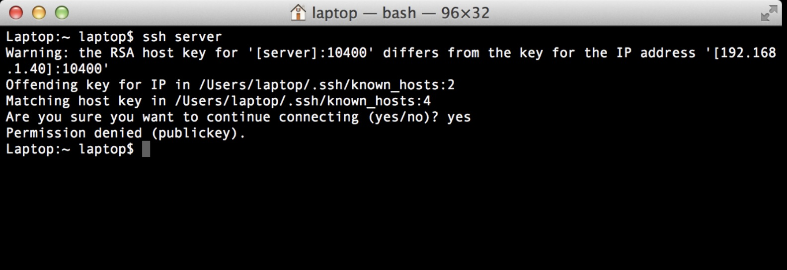

Every computer person knows about the time consuming "@WARNING: REMOTE HOST IDENTIFICATION HAS CHANGED! @" line when trying to ssh into a system whose ssh key has changed.
 This is nothing serious, you get the line number from the warning and delete it from your known_hosts file. Simple but time consuming.
 I came across this tip from [Scott Granneman](https://chainsawonatireswing.com/2012/04/06/an-easier-quicker-way-to-edit-the-known_hosts-file-when-an-ssh-server-changes-its-host-key/) years ago and I keep
 forgetting to mention it to the thousands who read what I put up here. Well, maybe it's just one person, ok none. The trick enables you to just type knownhosts 555 and line 555 of known_hosts will be deleted and you can ssh into the machine with no error. I won't spoil the surprise, but it's a pretty basic script, so go put it on your system. Knownhosts script.
